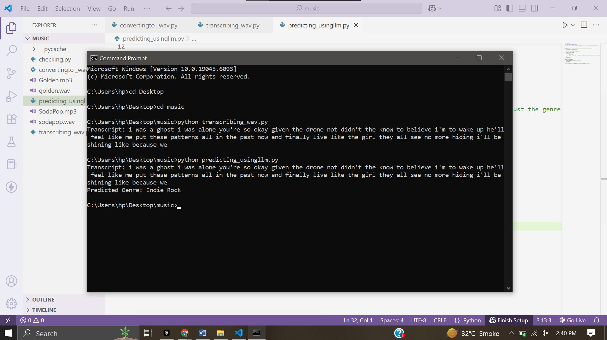

# Music_Genre_Predictor_UsingAPIs
Music Genre Predictor Developed Using APIs




from pathlib import Path

readme_text = """
# 🎵 YouTube Music Genre Predictor

This project automatically **downloads a YouTube song**, converts it to audio, transcribes it using **Deepgram**, and then predicts the **music genre** using an **LLM hosted by Groq**.

---

## 🚀 What It Does

1. 🎥 **Downloads audio** from a YouTube video using `yt-dlp` (manual step in this version).
2. 🎧 **Converts** the audio to a Deepgram-compatible `.wav` file.
3. 🧠 **Transcribes** the audio to lyrics using Deepgram’s Speech-to-Text API.
4. 🤖 **Predicts** the genre using LLaMA3 (Groq-hosted LLM) through a prompt.
5. 🏷️ Returns the **music genre** (e.g. Pop, Rock, Rap, etc.) based on the transcript.

---

## 🛠 Tech Stack

- **Python**
- **yt-dlp** – for downloading YouTube videos (manual trigger)
- **pydub** – for converting `.mp3` to `.wav`
- **Deepgram API** – for audio transcription
- **Groq API (OpenAI-compatible)** – for language modeling and genre prediction

---

## 🗂 File Breakdown

| File | Purpose |
|------|---------|
| `convertingto_wav.py` | Converts `.mp3` audio into `.wav` format |
| `transcribing_wav.py` | Sends `.wav` file to Deepgram and receives a transcript |
| `predicting_usingllm.py` | Uses LangChain + Groq to predict the genre from the transcript |
| `checking.py` | Raw HTTP request version of genre prediction (no LangChain) |

---

## How to Run

1. 🔻 **Download a YouTube song manually** as MP3 using:
   ```bash
   yt-dlp -x --audio-format mp3 "https://youtube.com/watch?v=YOUR_VIDEO"
